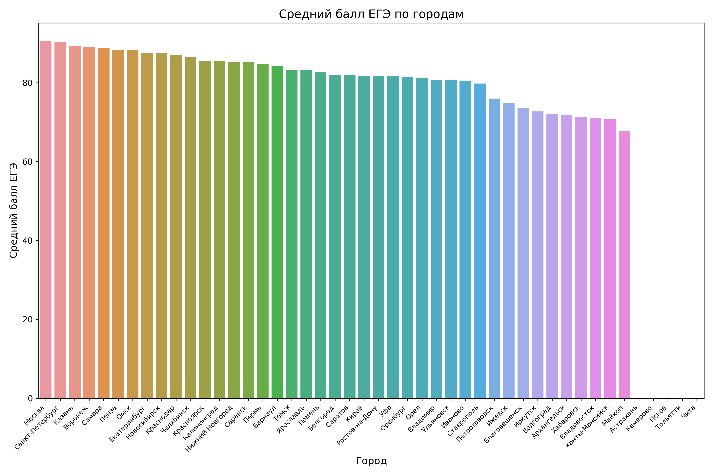
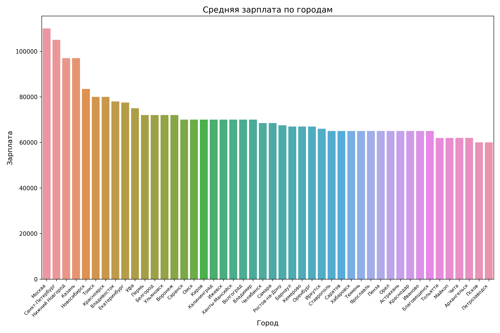
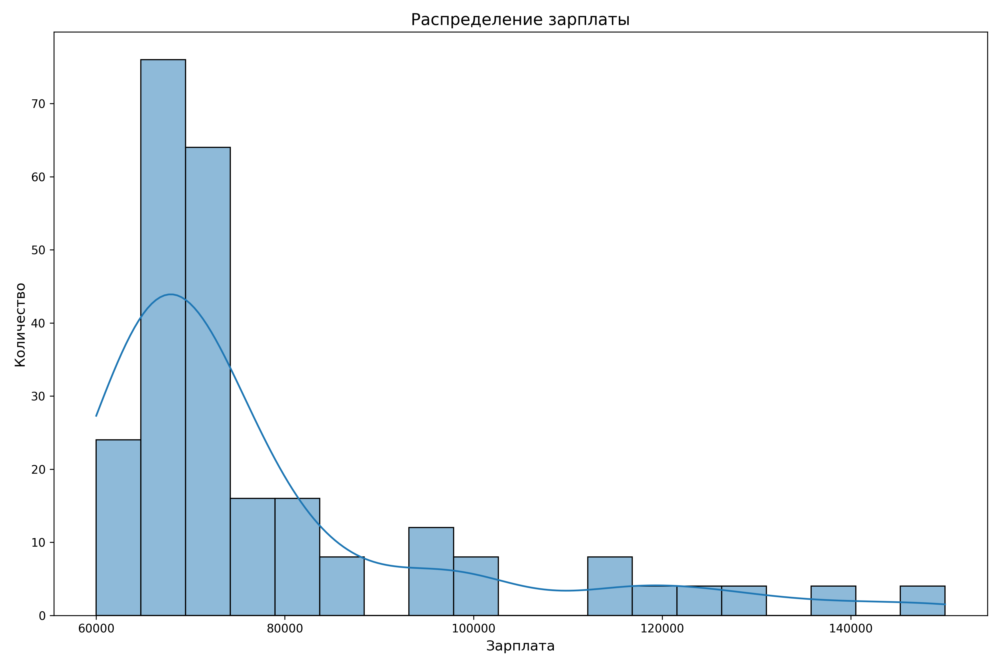

# Проект "Анализ лучших экономических вузов России"
## Описание проекта

Этот проект представляет собой набор таблиц, которые помогают проанализировать лучшие экономические вузы России. Рейтинг вузов основан на средней зарплате, на которую могут претендовать выпускники, и взят с веб-сайта [students.superjob.ru](https://students.superjob.ru/reiting-vuzov/ekonomicheskie/). Следует отметить, что рейтинг может быть субъективным.

## Компоненты проекта

### 1. Обработка данных с помощью pandas

Для обработки данных использовалась библиотека pandas. Были загружены таблицы с показателями среднего балла, средней зарплаты и процентом выпускников, оставшихся в регионе после окончания обучения. В проекте применяются продвинутые возможности pandas, такие как визуализация распределения зарплат выпускников в зависимости от города и группировка данных. Библиотека pandas используется во множестве частей кода.

### 2. Веб-скрапинг

Для получения информации о лучших экономических вузах использовался веб-скрапинг. Процесс скрапинга осуществлялся с использованием библиотеки Selenium для открытия страницы и полной загрузки таблицы вузов (с помощью пролистывания страницы вниз) и библиотеки BeautifulSoup для последующего извлечения необходимых данных. Код для веб-скрапинга можно найти в файле `src/scrapers/scraper.py`.

### 3. Работа с REST API (XML/JSON)

В проекте также используется REST API. Было реализовано получение данных с помощью Nominatim API, предоставляемого OpenStreetMap. API использовалось для получения координат городов по их названию с целью последующей визуализации точек вузов на карте. Код для работы с API можно найти в файле `src/visualization/geo.py`.

### 4. Визуализация данных

В проекте применяются продвинутые методы визуализации данных, включая:

а. Столбчатые диаграммы, отображающие средний балл ЕГЭ для каждого города, в котором расположены университеты. Эти диаграммы позв

оляют определить рекомендуемые целевые баллы для поступления в экономический вуз в конкретном городе.

б. Столбчатые диаграммы, показывающие среднюю зарплату для каждого города, в котором расположены университеты. Эти диаграммы помогают оценить ожидаемую среднюю зарплату после окончания обучения в конкретном городе.

в. Гистограммы, отображающие распределение зарплат в выборке данных. Это позволяет понять, какую зарплату может ожидать выпускник экономического вуза в целом.

Исходный код для визуализации данных можно найти в файле `src/visualization/graphics.py`, а сгенерированные изображения хранятся в папке `src/data`.

Также результаты визуализации можно посмотреть в папке src/data

### 5. Математические возможности Python

В проекте использовалась библиотека NumPy при работе с геоданными.

### 6. Streamlit

Проект размещен в интернете. Выходные данные, такие как карта с гео-визуализацией, гистограммы и диаграммы, доступны по адресу [https://cubich.ru/sovbak](https://cubich.ru/sovbak). Вы можете получить список доступных файлов по адресу [https://cubich.ru/sovbak/files](https://cubich.ru/sovbak/files), а также получить конкретный файл, добавив его имя к адресу, например: [https://cubich.ru/sovbak/files/map.html](https://cubich.ru/sovbak/files/map.html) - Геовизуализация ВУЗов на карте России.

### 7. SQL

В проекте используется база данных PostgreSQL для хранения данных, полученных с помощью веб-скрапинга. Для работы с базой данных используется библиотека SQLAlchemy.

### 8. Регулярные выражения

Регулярные выражения применяются при веб-скрапинге для проверки формата полученных данных перед их сохранением в базу данных.

### 9. Работа с геоданными

Для работы с геоданными используются библиотеки GeoPandas, Shapely, Folium и другие. Они позволяют визуализировать вузы на карте России. Код для работы с геоданными находится в файле `src/visualization/geo.py`.

### 10. Дополнительные технологии

Проект использует FastAPI

 для реализации эндпоинтов, предоставляющих файлы для публичного доступа в сети, а также для реализации функциональности Streamlit. Также в проекте используется SQLAlchemy для работы с моделями данных PostgreSQL.

### 11. Объем проекта

Общий объем проекта составляет более 120 строк кода.

### 12. Целостность проекта

Структура проекта организована грамотно и разделена на модули.

### 13. Общее впечатление

Надеюсь, что вам всё понравилось!

P.S.: Для удобства тестирования реализован docker-compose файл, который поднимает базу данных PostgreSQL. Затем необходимо установить все библиотеки для python с помощью команды pip instal -r requirements.txt

И запустить проект python3 src/main.py.
Не забудьте заменить Chrome в селениум на нужный для вашей системы.

## Результаты работы визуализации (кроме гео)

